# Trellis Framework — Architecture Diagrams

Visual companion to TDD.md. Render with any Mermaid-capable viewer.

---

## Assembly Dependency

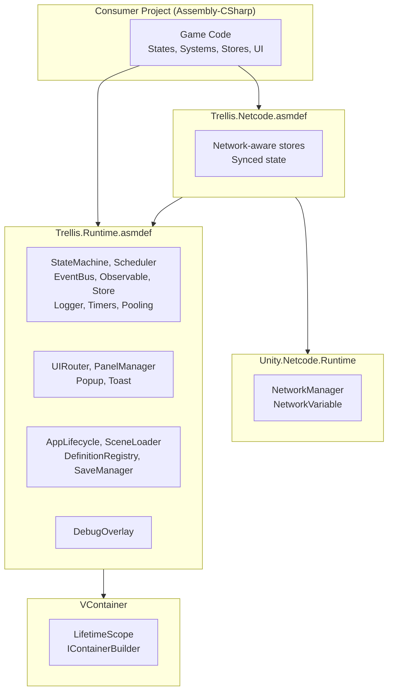
```mermaid
graph TD
    subgraph Consumer ["Consumer Project (Assembly-CSharp)"]
        Game["Game Code<br/>States, Systems, Stores, UI"]
    end

    subgraph TrellisNet ["Trellis.Netcode.asmdef"]
        Netcode["Network-aware stores<br/>Synced state"]
    end

    subgraph TrellisRT ["Trellis.Runtime.asmdef"]
        Core["StateMachine, Scheduler<br/>EventBus, Observable, Store<br/>Logger, Timers, Pooling"]
        UI["UIRouter, PanelManager<br/>Popup, Toast"]
        App["AppLifecycle, SceneLoader<br/>DefinitionRegistry, SaveManager"]
        Debug["DebugOverlay"]
    end

    subgraph VCon ["VContainer"]
        DI["LifetimeScope<br/>IContainerBuilder"]
    end

    subgraph NGO ["Unity.Netcode.Runtime"]
        NGOLib["NetworkManager<br/>NetworkVariable"]
    end

    Game --> TrellisRT
    Game --> TrellisNet
    TrellisRT --> VCon
    TrellisNet --> TrellisRT
    TrellisNet --> NGO
```

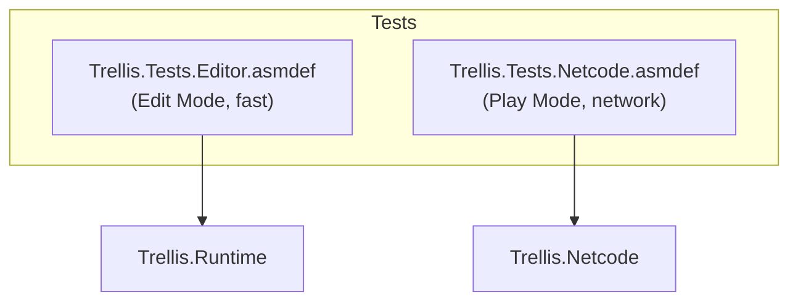
```mermaid
graph TD
    subgraph Tests
        TE["Trellis.Tests.Editor.asmdef<br/>(Edit Mode, fast)"]
        TN["Trellis.Tests.Netcode.asmdef<br/>(Play Mode, network)"]
    end

    TE --> TrellisRT["Trellis.Runtime"]
    TN --> TrellisNetcode["Trellis.Netcode"]
```

---

## Package Structure Overview

```
Trellis/
├── package.json                    com.trellis.framework v0.2.0
├── Runtime/
│   ├── Trellis.Runtime.asmdef      → VContainer dependency
│   ├── StateMachine/               IState, StateMachine, HierarchicalStateMachine
│   ├── Scheduling/                 ISystem, SystemScheduler
│   ├── Pooling/                    IPoolable, GameObjectPool, PoolManager
│   ├── Events/                     EventBus, IEventSubscription
│   ├── Reactive/                   Observable<T>, ReadOnlyObservable<T>
│   ├── Stores/                     Store<T>, StoreActions<T>, ILoadObject<T>
│   ├── UI/                         UIRouter, PanelManager, PopupManager, ToastManager
│   ├── App/                        AppLifecycleManager
│   ├── Scenes/                     SceneLoader, SceneTransition
│   ├── Logging/                    TrellisLogger, ILogSink
│   ├── Debug/                      DebugOverlay, IDebugSection
│   ├── Data/                       DefinitionRegistry, SaveManager
│   └── Timing/                     Timer, TimerManager
├── Netcode/
│   └── Trellis.Netcode.asmdef      → Trellis.Runtime + NGO
└── Tests/
    ├── Editor/                     Edit Mode tests (pure C#)
    └── Netcode/                    Play Mode tests (network)
```

---

## FLUX-Inspired Data Flow

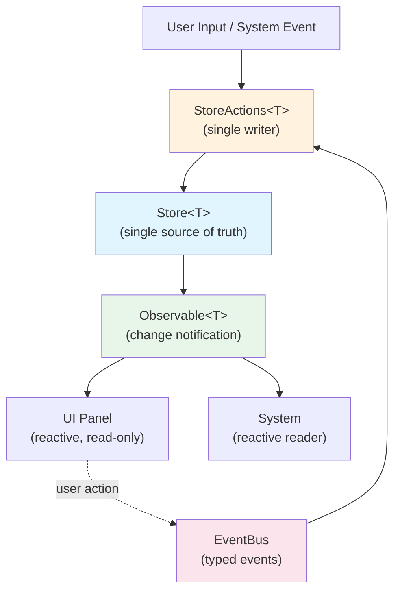
```mermaid
flowchart TD
    Input["User Input / System Event"] --> Actions["StoreActions&lt;T&gt;<br/>(single writer)"]
    Actions --> Store["Store&lt;T&gt;<br/>(single source of truth)"]
    Store --> Observable["Observable&lt;T&gt;<br/>(change notification)"]
    Observable --> Panel["UI Panel<br/>(reactive, read-only)"]
    Observable --> System["System<br/>(reactive reader)"]
    Panel -.->|"user action"| EventBus["EventBus<br/>(typed events)"]
    EventBus --> Actions

    style Store fill:#e1f5fe
    style Actions fill:#fff3e0
    style Observable fill:#e8f5e9
    style EventBus fill:#fce4ec
```

**Data flow rules:**
1. `Store<T>` is the single source of truth
2. Only `StoreActions<T>` writes to a store
3. Changes propagate via `Observable<T>`
4. UI reads from observables, writes via EventBus or StoreActions
5. No bidirectional binding — data flows in one direction

---

## State Machine Lifecycle

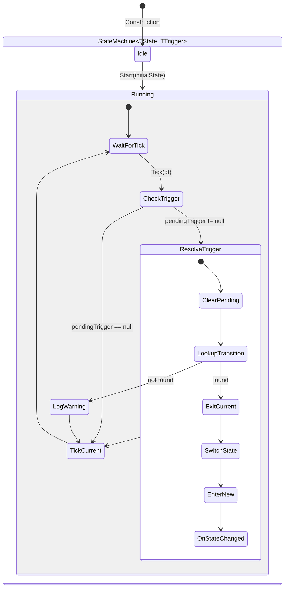
```mermaid
stateDiagram-v2
    [*] --> Idle : Construction

    state "StateMachine&lt;TState, TTrigger&gt;" as SM {
        Idle --> Running : Start(initialState)

        state Running {
            [*] --> WaitForTick

            WaitForTick --> CheckTrigger : Tick(dt)
            CheckTrigger --> ResolveTrigger : pendingTrigger != null
            CheckTrigger --> TickCurrent : pendingTrigger == null

            state ResolveTrigger {
                [*] --> ClearPending
                ClearPending --> LookupTransition
                LookupTransition --> ExitCurrent : found
                LookupTransition --> LogWarning : not found
                ExitCurrent --> SwitchState
                SwitchState --> EnterNew
                EnterNew --> OnStateChanged
            }

            ResolveTrigger --> TickCurrent
            LogWarning --> TickCurrent
            TickCurrent --> WaitForTick
        }
    }
```

**Key detail:** `pendingTrigger` is cleared BEFORE `ResolveTrigger` runs. If `Enter()` calls `Fire()`, the new trigger survives to the next `Tick()`.

---

## Hierarchical State Machine

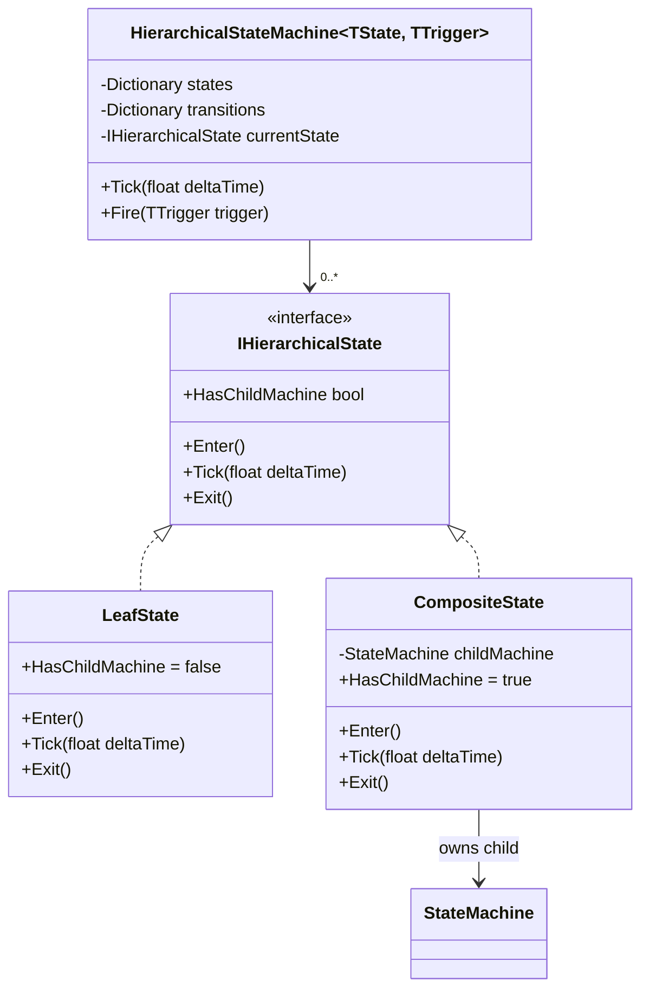
```mermaid
classDiagram
    class HierarchicalStateMachine~TState, TTrigger~ {
        -Dictionary states
        -Dictionary transitions
        -IHierarchicalState currentState
        +Tick(float deltaTime)
        +Fire(TTrigger trigger)
    }

    class IHierarchicalState {
        <<interface>>
        +Enter()
        +Tick(float deltaTime)
        +Exit()
        +HasChildMachine bool
    }

    class LeafState {
        +Enter()
        +Tick(float deltaTime)
        +Exit()
        +HasChildMachine = false
    }

    class CompositeState {
        -StateMachine childMachine
        +Enter()
        +Tick(float deltaTime)
        +Exit()
        +HasChildMachine = true
    }

    HierarchicalStateMachine --> "0..*" IHierarchicalState
    IHierarchicalState <|.. LeafState
    IHierarchicalState <|.. CompositeState
    CompositeState --> StateMachine : owns child
```

**Tick propagation:**
```
Parent.Tick(dt)
  └── currentState.Tick(dt)
        └── if CompositeState:
              childMachine.Tick(dt)
                └── childState.Tick(dt)
```

Child triggers stay within the child machine. Bubble-up to parent requires an explicit delegate call.

---

## Event Bus

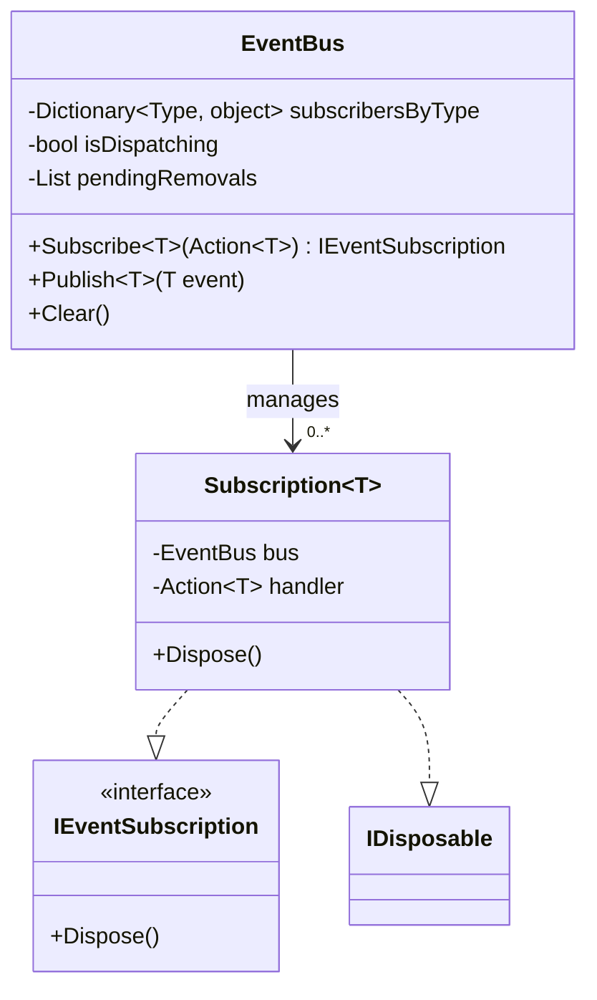
```mermaid
classDiagram
    class EventBus {
        -Dictionary~Type, object~ subscribersByType
        -bool isDispatching
        -List pendingRemovals
        +Subscribe~T~(Action~T~) IEventSubscription
        +Publish~T~(T event)
        +Clear()
    }

    class IEventSubscription {
        <<interface>>
        +Dispose()
    }

    class Subscription~T~ {
        -EventBus bus
        -Action~T~ handler
        +Dispose()
    }

    EventBus --> "0..*" Subscription : manages
    Subscription ..|> IEventSubscription
    Subscription ..|> IDisposable
```

### Event Dispatch Sequence

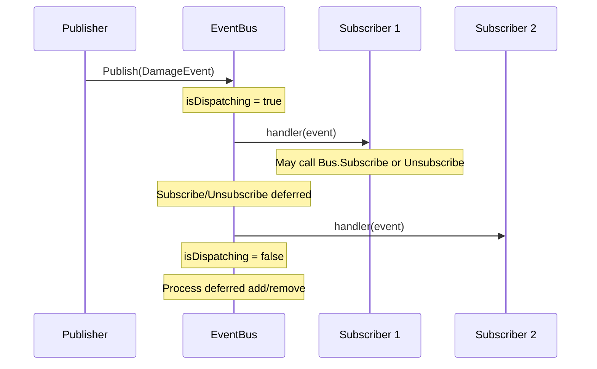
```mermaid
sequenceDiagram
    participant Publisher
    participant Bus as EventBus
    participant Sub1 as Subscriber 1
    participant Sub2 as Subscriber 2

    Publisher->>Bus: Publish(DamageEvent)
    Note over Bus: isDispatching = true

    Bus->>Sub1: handler(event)
    Note over Sub1: May call Bus.Subscribe or Unsubscribe
    Note over Bus: Subscribe/Unsubscribe deferred

    Bus->>Sub2: handler(event)

    Note over Bus: isDispatching = false
    Note over Bus: Process deferred add/remove
```

**Dispatch guarantees:**
- Subscribers called in subscription order (FIFO)
- Unsubscribe during dispatch is safe (deferred)
- New subscriptions during dispatch take effect after current dispatch completes
- Zero subscribers = no-op (no allocation)

---

## Reactive Properties

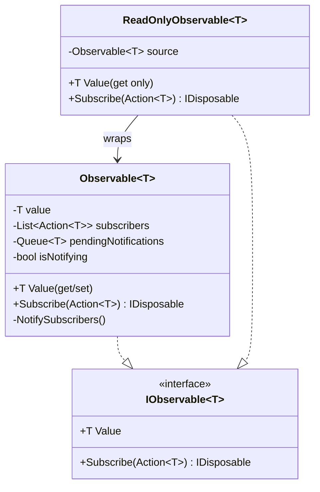
```mermaid
classDiagram
    class Observable~T~ {
        -T value
        -List~Action~T~~ subscribers
        -Queue~T~ pendingNotifications
        -bool isNotifying
        +T Value (get/set)
        +Subscribe(Action~T~) IDisposable
        -NotifySubscribers()
    }

    class ReadOnlyObservable~T~ {
        -Observable~T~ source
        +T Value (get only)
        +Subscribe(Action~T~) IDisposable
    }

    class IObservable~T~ {
        <<interface>>
        +T Value
        +Subscribe(Action~T~) IDisposable
    }

    Observable ..|> IObservable
    ReadOnlyObservable ..|> IObservable
    ReadOnlyObservable --> Observable : wraps
```

### Queue-Based Re-entrancy Prevention

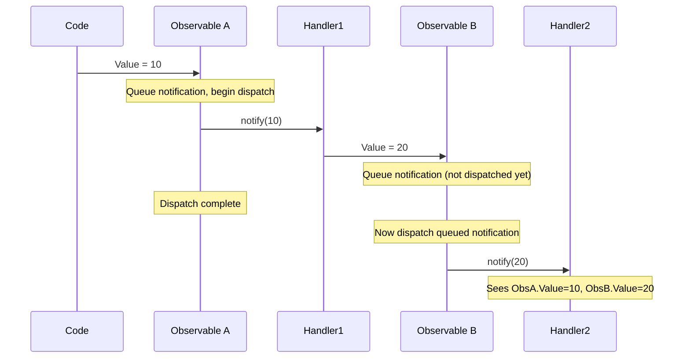
```mermaid
sequenceDiagram
    participant Code
    participant ObsA as Observable A
    participant Handler1
    participant ObsB as Observable B
    participant Handler2

    Code->>ObsA: Value = 10
    Note over ObsA: Queue notification, begin dispatch
    ObsA->>Handler1: notify(10)
    Handler1->>ObsB: Value = 20
    Note over ObsB: Queue notification (not dispatched yet)
    Note over ObsA: Dispatch complete

    Note over ObsB: Now dispatch queued notification
    ObsB->>Handler2: notify(20)
    Note over Handler2: Sees ObsA.Value=10, ObsB.Value=20
```

**Without queue-based dispatch**, Handler1 setting ObsB would trigger Handler2 inline, which could set ObsA again, causing infinite re-entrancy. The queue ensures each notification completes before the next begins.

---

## Store Pattern

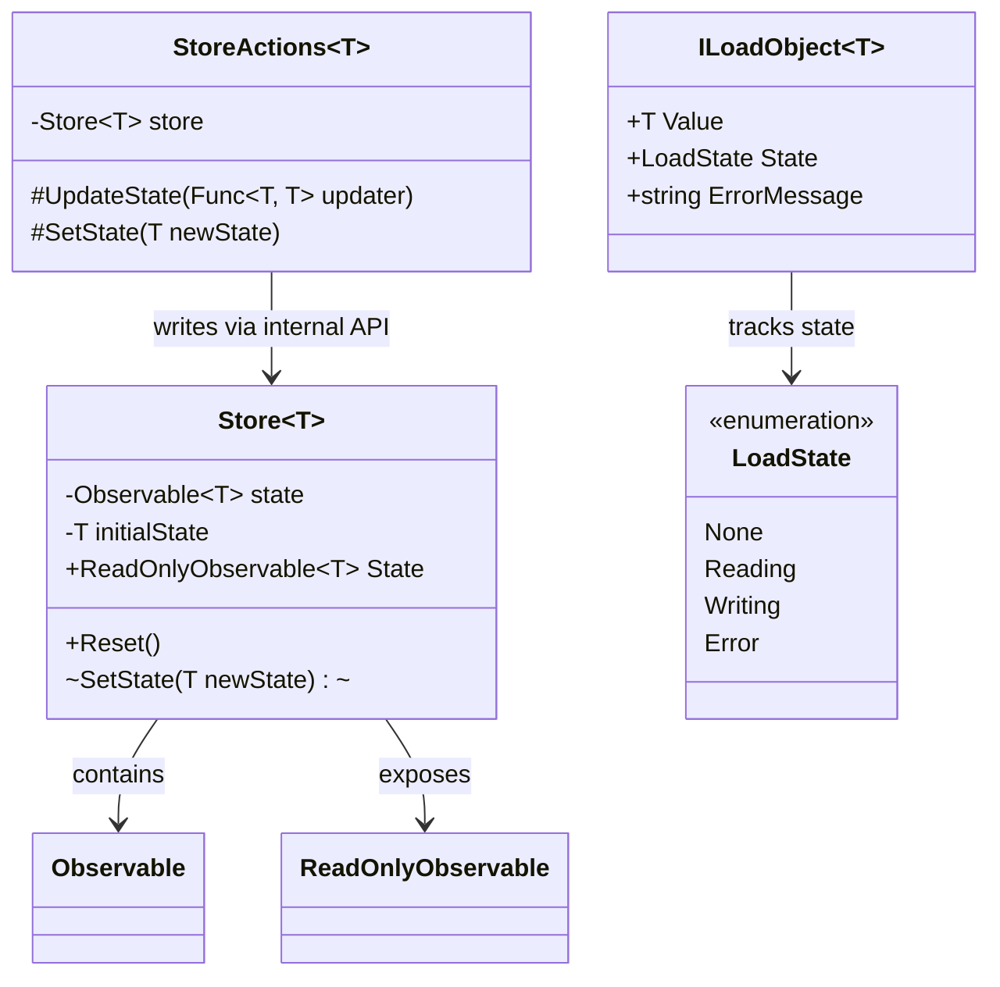
```mermaid
classDiagram
    class Store~T~ {
        -Observable~T~ state
        -T initialState
        +ReadOnlyObservable~T~ State
        +Reset()
        ~SetState(T newState)~
    }

    class StoreActions~T~ {
        -Store~T~ store
        #UpdateState(Func~T, T~ updater)
        #SetState(T newState)
    }

    class ILoadObject~T~ {
        +T Value
        +LoadState State
        +string ErrorMessage
    }

    class LoadState {
        <<enumeration>>
        None
        Reading
        Writing
        Error
    }

    StoreActions --> Store : writes via internal API
    Store --> Observable : contains
    Store --> ReadOnlyObservable : exposes
    ILoadObject --> LoadState : tracks state
```

### Store Data Flow Example

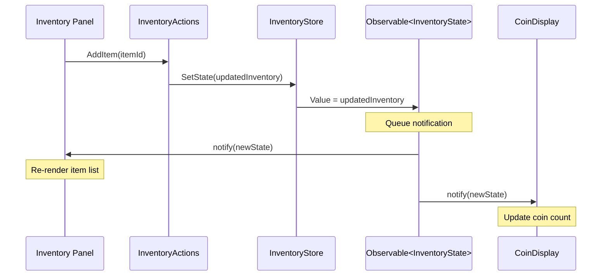
```mermaid
sequenceDiagram
    participant UI as Inventory Panel
    participant Actions as InventoryActions
    participant Store as InventoryStore
    participant Obs as Observable<InventoryState>
    participant HUD as CoinDisplay

    UI->>Actions: AddItem(itemId)
    Actions->>Store: SetState(updatedInventory)
    Store->>Obs: Value = updatedInventory
    Note over Obs: Queue notification

    Obs->>UI: notify(newState)
    Note over UI: Re-render item list

    Obs->>HUD: notify(newState)
    Note over HUD: Update coin count
```

---

## ILoadObject State Transitions

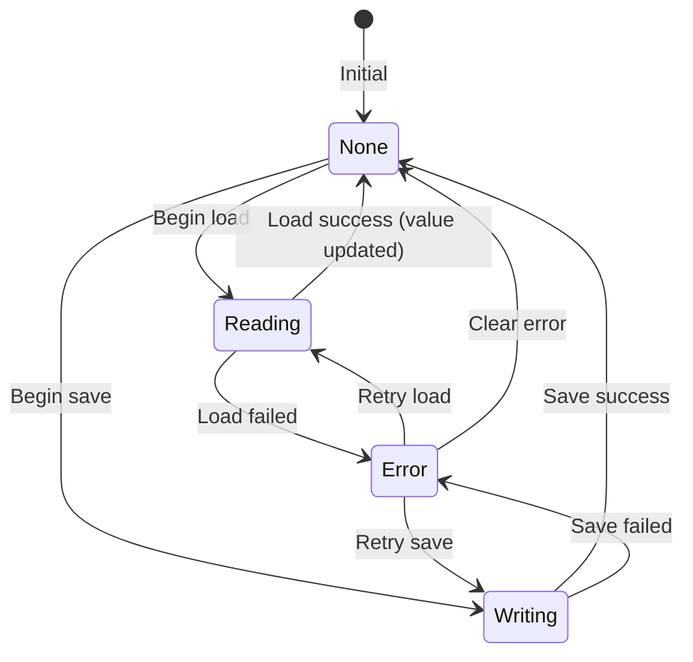
```mermaid
stateDiagram-v2
    [*] --> None : Initial

    None --> Reading : Begin load
    None --> Writing : Begin save

    Reading --> None : Load success (value updated)
    Reading --> Error : Load failed

    Writing --> None : Save success
    Writing --> Error : Save failed

    Error --> Reading : Retry load
    Error --> Writing : Retry save
    Error --> None : Clear error
```

Replaces boolean flag combinations (`isLoading`, `hasData`, `hasError`) with a single state enum. No invalid states possible.

---

## UI Architecture — Layout Zones

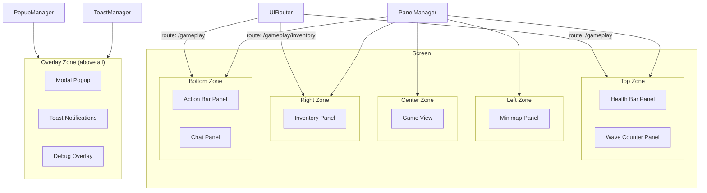
```mermaid
flowchart TD
    subgraph Screen
        subgraph TopZone ["Top Zone"]
            T1["Health Bar Panel"]
            T2["Wave Counter Panel"]
        end
        subgraph LeftZone ["Left Zone"]
            L1["Minimap Panel"]
        end
        subgraph CenterZone ["Center Zone"]
            C1["Game View"]
        end
        subgraph RightZone ["Right Zone"]
            R1["Inventory Panel"]
        end
        subgraph BottomZone ["Bottom Zone"]
            B1["Action Bar Panel"]
            B2["Chat Panel"]
        end
    end

    subgraph OverlayZone ["Overlay Zone (above all)"]
        O1["Modal Popup"]
        O2["Toast Notifications"]
        O3["Debug Overlay"]
    end

    Router["UIRouter"] -->|"route: /gameplay"| TopZone
    Router -->|"route: /gameplay"| BottomZone
    Router -->|"route: /gameplay/inventory"| RightZone
    PM["PanelManager"] --> TopZone
    PM --> LeftZone
    PM --> CenterZone
    PM --> RightZone
    PM --> BottomZone
    PopM["PopupManager"] --> OverlayZone
    ToastM["ToastManager"] --> OverlayZone
```

---

## UI Router — Route Resolution

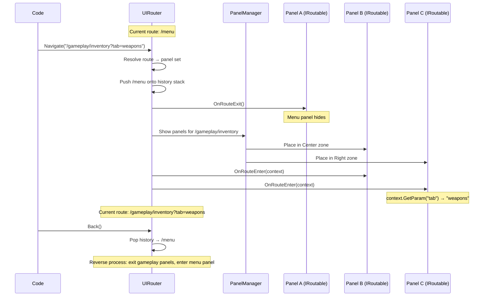
```mermaid
sequenceDiagram
    participant Code
    participant Router as UIRouter
    participant PM as PanelManager
    participant PanelA as Panel A (IRoutable)
    participant PanelB as Panel B (IRoutable)
    participant PanelC as Panel C (IRoutable)

    Note over Router: Current route: /menu

    Code->>Router: Navigate("/gameplay/inventory?tab=weapons")

    Router->>Router: Resolve route → panel set
    Router->>Router: Push /menu onto history stack

    Router->>PanelA: OnRouteExit()
    Note over PanelA: Menu panel hides

    Router->>PM: Show panels for /gameplay/inventory
    PM->>PanelB: Place in Center zone
    PM->>PanelC: Place in Right zone

    Router->>PanelB: OnRouteEnter(context)
    Router->>PanelC: OnRouteEnter(context)
    Note over PanelC: context.GetParam("tab") → "weapons"

    Note over Router: Current route: /gameplay/inventory?tab=weapons

    Code->>Router: Back()
    Router->>Router: Pop history → /menu
    Note over Router: Reverse process: exit gameplay panels, enter menu panel
```

---

## Popup Queue

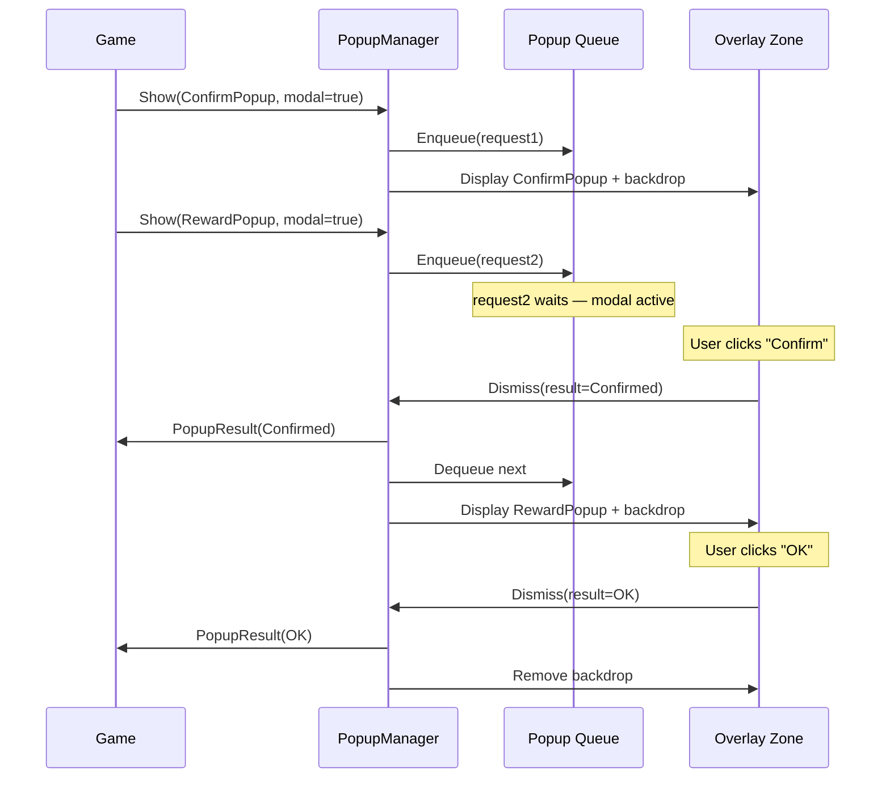
```mermaid
sequenceDiagram
    participant Game
    participant PM as PopupManager
    participant Queue as Popup Queue
    participant Overlay as Overlay Zone

    Game->>PM: Show(ConfirmPopup, modal=true)
    PM->>Queue: Enqueue(request1)
    PM->>Overlay: Display ConfirmPopup + backdrop

    Game->>PM: Show(RewardPopup, modal=true)
    PM->>Queue: Enqueue(request2)
    Note over Queue: request2 waits — modal active

    Note over Overlay: User clicks "Confirm"
    Overlay->>PM: Dismiss(result=Confirmed)
    PM->>Game: PopupResult(Confirmed)
    PM->>Queue: Dequeue next
    PM->>Overlay: Display RewardPopup + backdrop

    Note over Overlay: User clicks "OK"
    Overlay->>PM: Dismiss(result=OK)
    PM->>Game: PopupResult(OK)
    PM->>Overlay: Remove backdrop
```

---

## Boot & Initialization Sequence

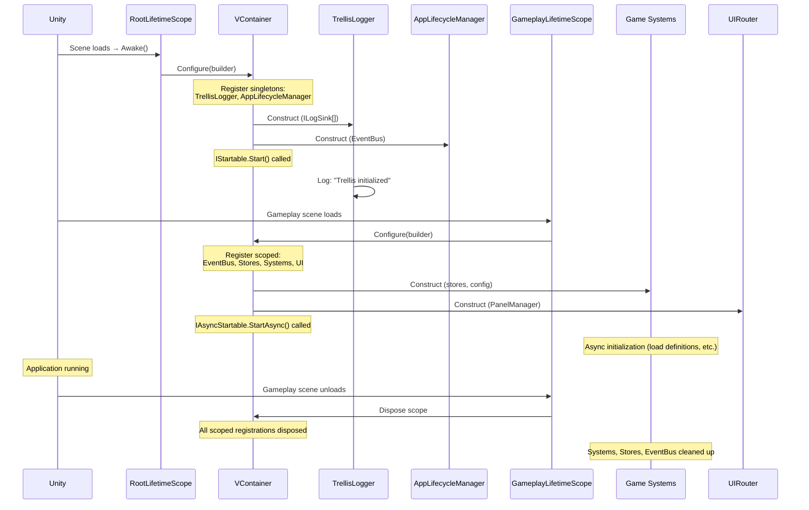
```mermaid
sequenceDiagram
    participant Unity
    participant Root as RootLifetimeScope
    participant VCon as VContainer
    participant Logger as TrellisLogger
    participant AppMgr as AppLifecycleManager
    participant Child as GameplayLifetimeScope
    participant Systems as Game Systems
    participant Router as UIRouter

    Unity->>Root: Scene loads → Awake()
    Root->>VCon: Configure(builder)
    Note over VCon: Register singletons:<br/>TrellisLogger, AppLifecycleManager

    VCon->>Logger: Construct (ILogSink[])
    VCon->>AppMgr: Construct (EventBus)

    Note over VCon: IStartable.Start() called
    Logger->>Logger: Log: "Trellis initialized"

    Unity->>Child: Gameplay scene loads
    Child->>VCon: Configure(builder)
    Note over VCon: Register scoped:<br/>EventBus, Stores, Systems, UI

    VCon->>Systems: Construct (stores, config)
    VCon->>Router: Construct (PanelManager)

    Note over VCon: IAsyncStartable.StartAsync() called
    Note over Systems: Async initialization (load definitions, etc.)

    Note over Unity: Application running

    Unity->>Child: Gameplay scene unloads
    Child->>VCon: Dispose scope
    Note over VCon: All scoped registrations disposed
    Note over Systems: Systems, Stores, EventBus cleaned up
```

**Key points:**
- Root scope holds singletons that persist across scenes
- Child scopes hold per-scene or per-session registrations
- Scope disposal is the cleanup mechanism — no explicit shutdown code needed
- Different boot profiles = different child scope configurations

---

## Structured Logger

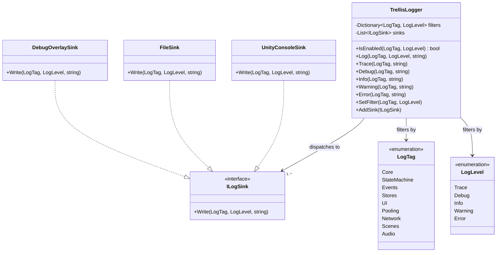
```mermaid
classDiagram
    class TrellisLogger {
        -Dictionary~LogTag, LogLevel~ filters
        -List~ILogSink~ sinks
        +IsEnabled(LogTag, LogLevel) bool
        +Log(LogTag, LogLevel, string)
        +Trace(LogTag, string)
        +Debug(LogTag, string)
        +Info(LogTag, string)
        +Warning(LogTag, string)
        +Error(LogTag, string)
        +SetFilter(LogTag, LogLevel)
        +AddSink(ILogSink)
    }

    class ILogSink {
        <<interface>>
        +Write(LogTag, LogLevel, string)
    }

    class UnityConsoleSink {
        +Write(LogTag, LogLevel, string)
    }

    class FileSink {
        +Write(LogTag, LogLevel, string)
    }

    class DebugOverlaySink {
        +Write(LogTag, LogLevel, string)
    }

    class LogTag {
        <<enumeration>>
        Core
        StateMachine
        Events
        Stores
        UI
        Pooling
        Network
        Scenes
        Audio
    }

    class LogLevel {
        <<enumeration>>
        Trace
        Debug
        Info
        Warning
        Error
    }

    TrellisLogger --> "1..*" ILogSink : dispatches to
    UnityConsoleSink ..|> ILogSink
    FileSink ..|> ILogSink
    DebugOverlaySink ..|> ILogSink
    TrellisLogger --> LogTag : filters by
    TrellisLogger --> LogLevel : filters by
```

### Zero-Allocation Filtering

```csharp
// This pattern avoids string allocation when filtered out:
if (logger.IsEnabled(LogTag.Network, LogLevel.Debug))
{
    logger.Log(LogTag.Network, LogLevel.Debug, $"Packet received: {packetSize} bytes");
}

// Convenience methods wrap this pattern:
logger.Debug(LogTag.Network, $"Packet received: {packetSize} bytes");
// Internally: if (!IsEnabled(tag, Debug)) return; — string never allocated
```

---

## Timer System

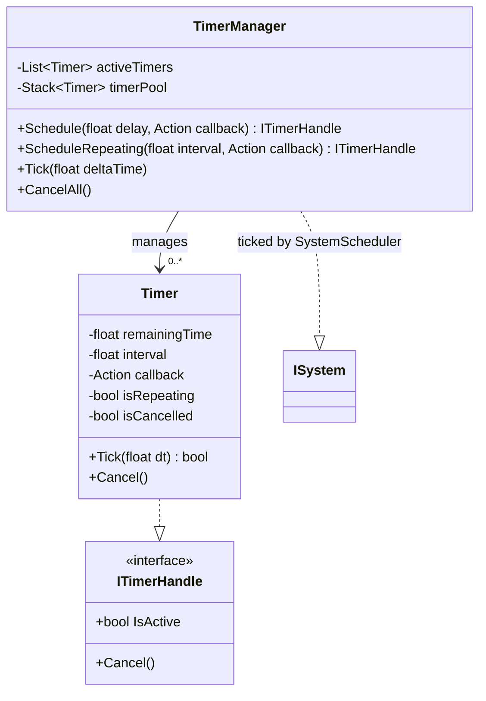
```mermaid
classDiagram
    class TimerManager {
        -List~Timer~ activeTimers
        -Stack~Timer~ timerPool
        +Schedule(float delay, Action callback) ITimerHandle
        +ScheduleRepeating(float interval, Action callback) ITimerHandle
        +Tick(float deltaTime)
        +CancelAll()
    }

    class Timer {
        -float remainingTime
        -float interval
        -Action callback
        -bool isRepeating
        -bool isCancelled
        +Tick(float dt) bool
        +Cancel()
    }

    class ITimerHandle {
        <<interface>>
        +Cancel()
        +bool IsActive
    }

    TimerManager --> "0..*" Timer : manages
    TimerManager ..|> ISystem : ticked by SystemScheduler
    Timer ..|> ITimerHandle
```

---

## Scene Loading

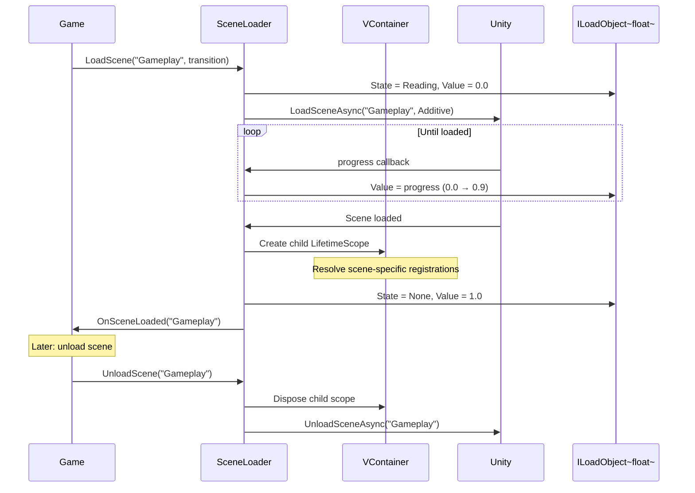
```mermaid
sequenceDiagram
    participant Game
    participant Loader as SceneLoader
    participant VCon as VContainer
    participant Unity
    participant Progress as ILoadObject~float~

    Game->>Loader: LoadScene("Gameplay", transition)
    Loader->>Progress: State = Reading, Value = 0.0

    Loader->>Unity: LoadSceneAsync("Gameplay", Additive)

    loop Until loaded
        Unity->>Loader: progress callback
        Loader->>Progress: Value = progress (0.0 → 0.9)
    end

    Unity->>Loader: Scene loaded
    Loader->>VCon: Create child LifetimeScope
    Note over VCon: Resolve scene-specific registrations

    Loader->>Progress: State = None, Value = 1.0
    Loader->>Game: OnSceneLoaded("Gameplay")

    Note over Game: Later: unload scene
    Game->>Loader: UnloadScene("Gameplay")
    Loader->>VCon: Dispose child scope
    Loader->>Unity: UnloadSceneAsync("Gameplay")
```

---

## Deliverable Dependency Graph

Each deliverable produces both framework code AND a Trellis-Starter demo. The demo name is shown in parentheses.

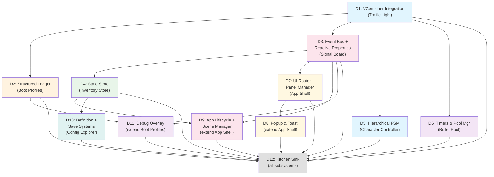
```mermaid
flowchart TD
    D1["D1: VContainer Integration<br/>(Traffic Light)"] --> D2["D2: Structured Logger<br/>(Boot Profiles)"]
    D1 --> D3["D3: Event Bus +<br/>Reactive Properties<br/>(Signal Board)"]
    D3 --> D4["D4: State Store<br/>(Inventory Store)"]
    D1 --> D5["D5: Hierarchical FSM<br/>(Character Controller)"]
    D1 --> D6["D6: Timers & Pool Mgr<br/>(Bullet Pool)"]
    D3 --> D7["D7: UI Router +<br/>Panel Manager<br/>(App Shell)"]
    D7 --> D8["D8: Popup & Toast<br/>(extend App Shell)"]
    D3 --> D9["D9: App Lifecycle +<br/>Scene Manager<br/>(extend App Shell)"]
    D4 --> D9
    D4 --> D10["D10: Definition +<br/>Save Systems<br/>(Config Explorer)"]
    D2 --> D11["D11: Debug Overlay<br/>(extend Boot Profiles)"]
    D3 --> D11
    D1 --> D12["D12: Kitchen Sink<br/>(all subsystems)"]
    D2 --> D12
    D3 --> D12
    D4 --> D12
    D5 --> D12
    D6 --> D12
    D7 --> D12
    D8 --> D12
    D9 --> D12
    D10 --> D12
    D11 --> D12

    style D1 fill:#e1f5fe
    style D2 fill:#fff3e0
    style D3 fill:#fce4ec
    style D4 fill:#e8f5e9
    style D5 fill:#e1f5fe
    style D6 fill:#f3e5f5
    style D7 fill:#fff8e1
    style D8 fill:#fff8e1
    style D9 fill:#fce4ec
    style D10 fill:#e0f2f1
    style D11 fill:#f3e5f5
    style D12 fill:#e0e0e0
```

**Critical path:** D1 → D3 → D4 → D9/D10 (foundation → events+reactive → stores → app infrastructure)

**Parallelizable after D1:** D2, D3, D5, D6 can all proceed in parallel once VContainer integration is done. Each produces its own standalone demo.

---

## App Lifecycle State Machine

```mermaid
stateDiagram-v2
    [*] --> Active : Construction

    Active --> Paused : NotifyPause(true)
    Paused --> Active : NotifyPause(false)

    Active --> Unfocused : NotifyFocus(false)
    Unfocused --> Active : NotifyFocus(true)

    Active --> Quitting : NotifyQuit()
    Paused --> Quitting : NotifyQuit()
    Unfocused --> Quitting : NotifyQuit()
```

**Key behavior:** Focus loss while Paused does NOT change state — Paused takes priority. Each transition publishes a corresponding struct event on the EventBus AND updates `Observable<AppState>`.

---

## Definition Registry Builder Pattern

```mermaid
sequenceDiagram
    participant Consumer
    participant Builder as DefinitionRegistryBuilder
    participant Source as IDefinitionSource
    participant Registry as DefinitionRegistry

    Consumer->>Builder: new(keyExtractor)
    Consumer->>Builder: Add(definition)
    Consumer->>Builder: AddSource(source)
    Builder->>Source: LoadDefinitions(list)
    Source-->>Builder: populated list
    Note over Builder: Validate uniqueness per key
    Consumer->>Builder: Build()
    Builder->>Registry: new(immutable copy)
    Note over Builder: Builder locked — cannot reuse

    Consumer->>Registry: TryGet(key, out def)
    Registry-->>Consumer: true + definition
```

---

## Save System

```mermaid
classDiagram
    class SaveManager {
        -ISaveSerializer serializer
        -ISaveStorage storage
        -List~ISaveable~ saveables
        +Register(ISaveable)
        +Save(string slotId)
        +Load(string slotId) bool
        +DeleteSlot(string slotId)
        +SlotExists(string slotId) bool
    }

    class ISaveable {
        <<interface>>
        +string SaveKey
        +CaptureState() object
        +RestoreState(object)
    }

    class ISaveSerializer {
        <<interface>>
        +Serialize~T~(T) byte[]
        +Deserialize~T~(byte[]) T
    }

    class ISaveStorage {
        <<interface>>
        +Exists(string) bool
        +Write(string, byte[])
        +Read(string) byte[]
        +Delete(string)
    }

    class SaveSlot {
        +string SlotId
        +SetEntry(string, byte[])
        +GetEntry(string) byte[]
        +HasEntry(string) bool
    }

    SaveManager --> ISaveSerializer
    SaveManager --> ISaveStorage
    SaveManager --> "0..*" ISaveable
    SaveManager ..> SaveSlot : creates during save
```

---

## Debug Overlay

```mermaid
classDiagram
    class DebugOverlay {
        -List~IDebugSection~ sections
        -Dictionary~string, DebugCommand~ commands
        -List~string~ commandLog
        +bool IsVisible
        +Toggle()
        +AddSection(IDebugSection)
        +RegisterCommand(DebugCommand)
        +ExecuteCommand(string) string
    }

    class IDebugSection {
        <<interface>>
        +string Title
        +string Content()
        +bool IsActive
    }

    class DebugCommand {
        +string Name
        +string Description
        +Func~string[], string~ Handler
    }

    DebugOverlay --> "0..*" IDebugSection
    DebugOverlay --> "0..*" DebugCommand
```

---

## Toast Queue

```mermaid
sequenceDiagram
    participant Code
    participant TM as ToastManager
    participant UI as Toast UI

    Code->>TM: Show("Saved", 3s)
    TM->>UI: OnShowToast(request, id=0)
    Note over UI: Toast visible

    Code->>TM: Show("Level Up!", 3s)
    TM->>UI: OnShowToast(request, id=1)
    Note over UI: Two toasts visible

    Code->>TM: Show("Achievement!", 3s)
    TM->>UI: OnShowToast(request, id=2)
    Note over UI: Three toasts (max)

    Code->>TM: Show("Bonus!", 3s)
    Note over TM: Queue — max visible reached

    Note over TM: Tick(3.1s)
    TM->>UI: OnHideToast(id=0)
    TM->>UI: OnHideToast(id=1)
    TM->>UI: OnHideToast(id=2)
    TM->>UI: OnShowToast("Bonus!", id=3)
    Note over UI: Queued toast now visible
```
